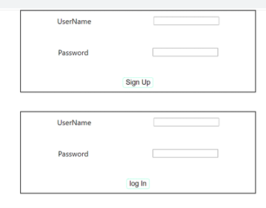
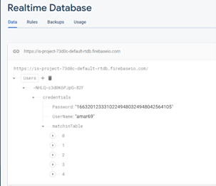

# Cryptographic Login Interface

## Implementation

We have created our own cryptographic algorithm which 
can do both encryption and decryption. We have named it Ascii Cipher, which is based on operations on ascii value of characters.
As for web implementation we have created a single page Sign Up/ Login form. 

<li>	During Signup Phase : password entered as plaintext will be encrypted into ciphertext and this text will be stored in the database.</li>
<li> During Login Phase : password entered by the user first will be checked via decrypting the cipher password kept in database. </li>

## Technology Used
* React Js
* Google Firebase
* Vanilla JavaScript
* Html/ CSS

## Algorithm 
Cipher Technique used is **Ascii Cipher** created by [Sarvagya Saxena](https://github.com/Kaizoku01 "Title")  & [Amar Upadhyay](https://github.com/amarr002 "Title").

## Output

